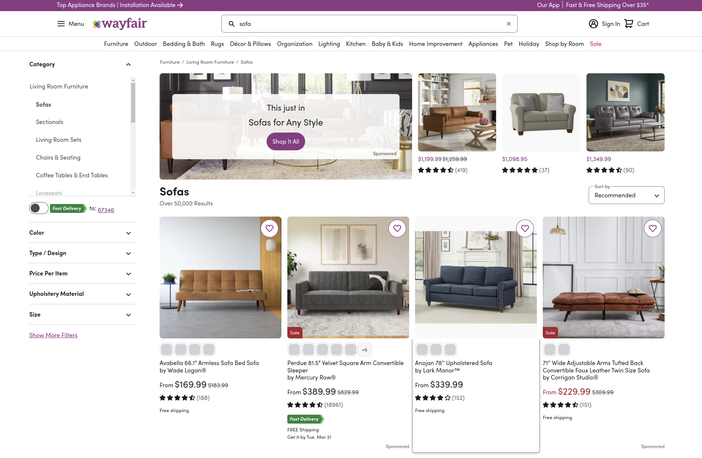
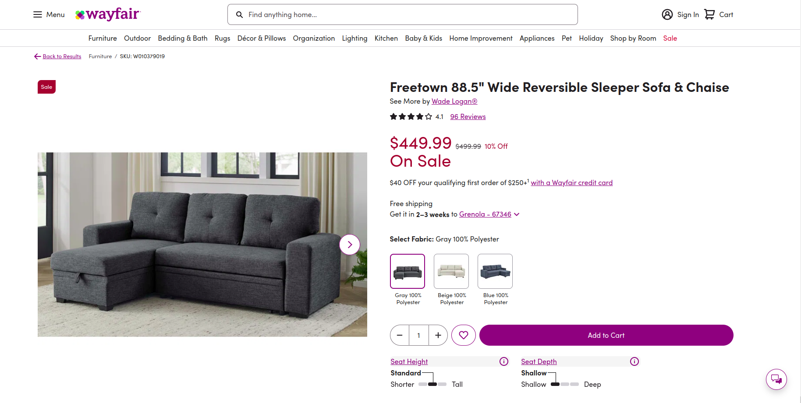
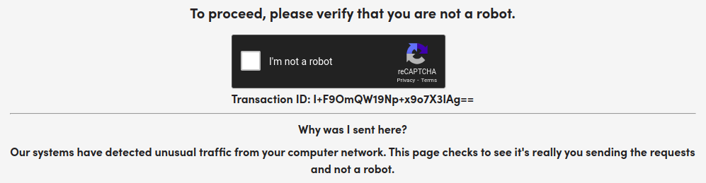
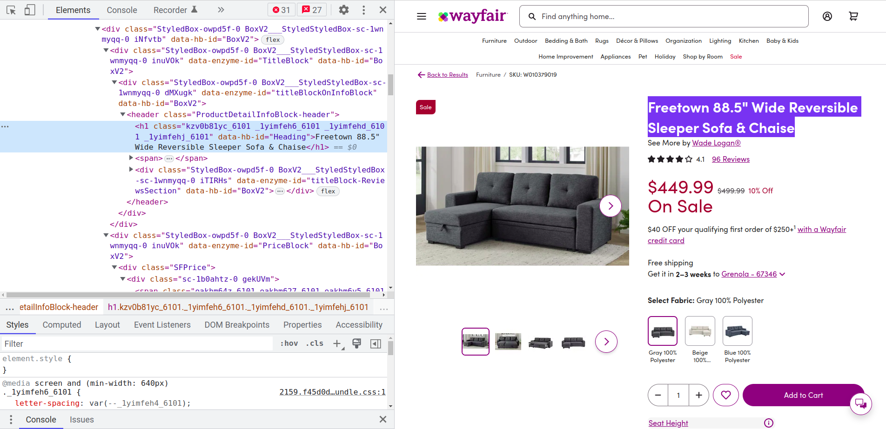
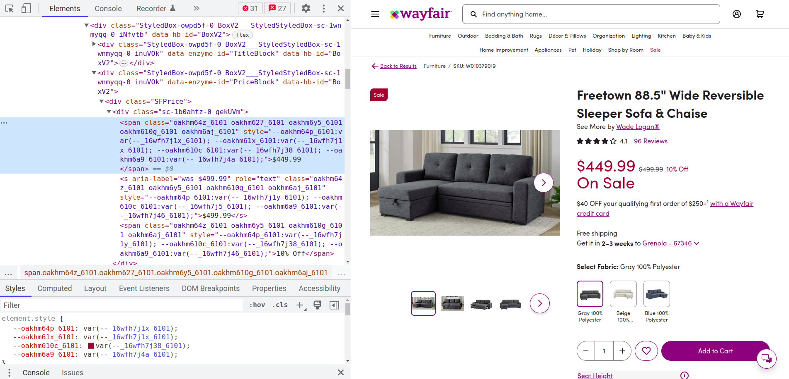

# How to Scrape Product Data From Wayfair: A Step-by-Step Guide

[](https://oxylabs.io/products/scraper-api/ecommerce/wayfair?utm_source=877&utm_medium=affiliate&groupid=877&utm_content=wayfair-github&transaction_id=102f49063ab94276ae8f116d224b67)

[](https://discord.gg/Pds3gBmKMH) [](https://www.youtube.com/@oxylabs)

## Introduction

The following Python tutorial will explore how to scrape data from Wayfair using [<u>Oxylabs Wayfair Scraper API</u>](https://oxylabs.io/products/scraper-api/ecommerce/wayfair). Read on for the page layout overview, project environment preparation, fetching the Wayfair product page for data extraction, and export to CSV or JSON format.

## Overview of Wayfair page layout

Before getting technical, let’s analyze the Wayfair page layout. Here are some of the most relevant types.

### 1. Search result page

The search result page appears when searching for products. For example, if you search for the term Sofa, the search result will be similar to the one below:



You can extract all the products listed for the search term “Sofa” as well as their links, titles, prices, ratings, and images. 

### 2. Product listing page

Product listing appears when you click on a product to see the details. It shows all the product information in addition to the main data already visible on the search result page.



### 3. reCAPTCHA protection page

The reCAPTCHA protection page appears when Wayfair detects unusual browsing behavior, such as repeated or too-fast (for an organic user) navigation from page to page, indicating the use of automated scripts such as scrapers. The page looks similar to the one below:



Now, let’s see how to use Oxylabs Wayfair API to extract data from the Wayfair product page.

## Step 1 - setting up the project environment

To begin scraping Wayfair data, prepare the project environment. If you already have Python installed, you can skip the Python installation and only install the dependencies in your active Python environment.

### Installing Python

This tutorial is written using Python 3.11.2. However, it should also work with the older or latest version of Python 3. You can download the latest version of Python from the official web page.

### Installing dependencies

Once you have downloaded and installed Python,  install the following dependencies by executing the command below in the terminal or command prompt:

```bash
python -m pip install requests bs4 pandas
```

This command will install Requests, Beautiful Soup, and Pandas libraries. These modules will interact with the API and store data.

## Step 2 - Fetching product data

Here’s a target [product page](https://www.wayfair.com/furniture/pdp/ebern-designs-adryel-98-wide-microfibermicrosuede-right-hand-facing-sofa-chaise-w003629953.html). Use Wayfair Scraper API to fetch Wayfair product data and parse it using the Beautiful Soup library. Alternatively, instead of relying on the Beautiful Soup library, you can also parse Wayfair using [Custom Parser](https://developers.oxylabs.io/scraper-apis/custom-parser), a free feature available with all Scraper APIs.

### Wayfair Scraper API overview

Before starting, let’s discuss some of the most useful query parameters of Wayfair Scraper API.

You can scrape Wayfair by providing any Wayfair URL. You will only have to pass two required parameters: `url` and `source`. The `source` parameter must be set to `universal`, and the `url` should be a Wayfair web page URL. Find additional information about [forming Wayfair URLs](https://developers.oxylabs.io/scraper-apis/e-commerce-scraper-api/all-domains#forming-urls) in our documentation.

It also takes optional parameters such as `user_agent_type` and `callback_url`. The `user_agent_type` tells the API which device the user agent will use (e.g., desktop). Lastly, the `callback_url` parameter is used to specify a URL to which the server should send a response after processing the request. Take a look at an example of a payload:

```python
payload = {
    "source": "universal",
    "url": "https://www.wayfair.com/furniture/pdp/ebern-designs-adryel-98-wide-microfibermicrosuede-right-hand-facing-sofa-chaise-w003629953.html",
    "user_agent_type": "desktop",
    "callback_url": "<URL to your callback endpoint.>"
}
```

### Sending network requests

To start writing your Wayfair scraper, import the libraries and create a payload with the necessary variables. Since Wayfair uses JavaScript rendering to display prices dynamically, you should also use our Headless Browser to render JavaScript and wait for the price element to load.

```python
import requests
from bs4 import BeautifulSoup

product_url = "https://www.wayfair.com/furniture/pdp/ebern-designs-adryel-98-wide-microfibermicrosuede-right-hand-facing-sofa-chaise-w003629953.html"
payload = {
    "source": "universal",
    "url": product_url,
    "user_agent_type": "desktop_safari",
    "geo_location": "United States",
    "render": "html",
    "browser_instructions": [
        {
            "type": "wait_for_element",
            "selector": {
                "type": "css",
                "value": "div.SFPrice span.oakhm64z_6112"
            },
            "timeout_s": 10
        }
    ]
}

username = "USERNAME"
password = "PASSWORD"
```

Notice `username`, `password`, and `product_url` variables. You will have to use your Oxylabs sub-user’s username and password. Also, if you wish, you can replace the `product_url` with the desired URL.

Next, send a POST request using the Requests module to Oxylabs' realtime API endpoint: <https://realtime.oxylabs.io/v1/queries>.

```python
response = requests.post(
    "https://realtime.oxylabs.io/v1/queries",
    auth=(username, password),
    json=payload,
    timeout=180
)
print(response.status_code)
```

In the code above, the POST method of the Requests module is used to send a POST request to the API. The sub-user’s credentials are passed for authentication, and the payload is sent in JSON format.

If you run this code, you’ll see `200` as an output which indicates success. If you get any other status code, recheck your credentials and payload.

## Step 3 - Parsing data

Now, you can parse the content of the JSON response. The JSON object will have the content of the webpage in HTML format. Use BeautifulSoup to parse the HTML from the response:

```python
content = response.json()["results"][0]["content"]
soup = BeautifulSoup(content, "html.parser")
```

The default `html.parser` is in use. You can use a different parser if you want.

The `soup object` has the parsed HTML content. Now, parse the title, price, and rating from this object.

### Title

Using a browser, inspect the HTML properties of the product title. To open the inspect tab, right-click on the product title and click "inspect". You’ll see something similar to the image below:



According to the HTML property, write the following code to extract the title of this product:

```python
title = soup.find("h1", {"data-hb-id": "Heading"}).text
```

### Price

Inspect the price element and find the proper class attributes:



```python
price = soup.find("div", {"class": "SFPrice"}).find("span", {"class": "oakhm64z_6112"}).text
```

### Rating

Similarly, you can parse the rating element with the following code:

```python
rating = soup.find("span", {"class": "ProductRatingNumberWithCount-rating"}).text
```

The class attribute of the `span` element is used to identify the rating element and extract the text content.

## Step 4 - Exporting data

The product data is now parsed. Use Pandas to export the data in CSV and JSON formats. Next, create a list of dict objects with the parsed data and create a data frame:

```python
import pandas as pd
data = [{
   "Product Title": title,
   "Price": price,
   "Rating": rating,
   "Link": product_url,
}]
df = pd.DataFrame(data)
```

### Exporting data in CSV

Using the data frame object, export the data in a CSV file with a single line of code. Since you don’t need an index, set the index to `False`.

```python
df.to_csv("product_data.csv", index=False)
```

Once you execute this function, the script will create a file named "product_data.csv".

### Exporting data in JSON

Similarly, use the data frame to export the data in JSON format. Pass an additional parameter, `orient`, to indicate the need for JSON data in records format.

```python
df.to_json("product_data.json", orient="records")
```
Here's the full Wayfair product scraper code:
```python
import requests
from bs4 import BeautifulSoup
import pandas as pd

product_url = "https://www.wayfair.com/furniture/pdp/ebern-designs-adryel-98-wide-microfibermicrosuede-right-hand-facing-sofa-chaise-w003629953.html"
payload = {
    "source": "universal",
    "url": product_url,
    "user_agent_type": "desktop_safari",
    "geo_location": "United States",
    "render": "html",
    "browser_instructions": [
        {
            "type": "wait_for_element",
            "selector": {
                "type": "css",
                "value": "div.SFPrice span.oakhm64z_6112"
            },
            "timeout_s": 10
        }
    ]
}

username = "USERNAME"
password = "PASSWORD"

response = requests.post(
    "https://realtime.oxylabs.io/v1/queries",
    auth=(username, password),
    json=payload,
    timeout=180
)
print(response.status_code)

content = response.json()["results"][0]["content"]
soup = BeautifulSoup(content, "html.parser")

title = soup.find("h1", {"data-hb-id": "Heading"}).text
price = soup.find("div", {"class": "SFPrice"}).find("span", {"class": "oakhm64z_6112"}).text
rating = soup.find("span", {"class": "ProductRatingNumberWithCount-rating"}).text

data = [{
   "Product Title": title,
   "Price": price,
   "Rating": rating,
   "Link": product_url,
}]
df = pd.DataFrame(data)
df.to_csv("product_data.csv", index=False)
df.to_json("product_data.json", orient="records")
```

The script will create another file named "product_data.json" in the current folder containing the exports:
```json
[{"Product Title":"Adryel 2 - Piece Upholstered Sectional","Price":"$489.99","Rating":"4.1 ","Link":"https:\/\/www.wayfair.com\/furniture\/pdp\/ebern-designs-adryel-98-wide-microfibermicrosuede-right-hand-facing-sofa-chaise-w003629953.html"}]
```

## Conclusion

Building a scraper that can send requests as an actual browser and mimic human browsing behavior is quite difficult. Also, you would have to maintain it and keep it up to date with constant changes. Such micromanagement requires in-depth knowledge and extensive scraping experience.

With Wayfair Scraper API, you can shift your focus where it matters most - data analysis - instead of dealing with technicalities. 

